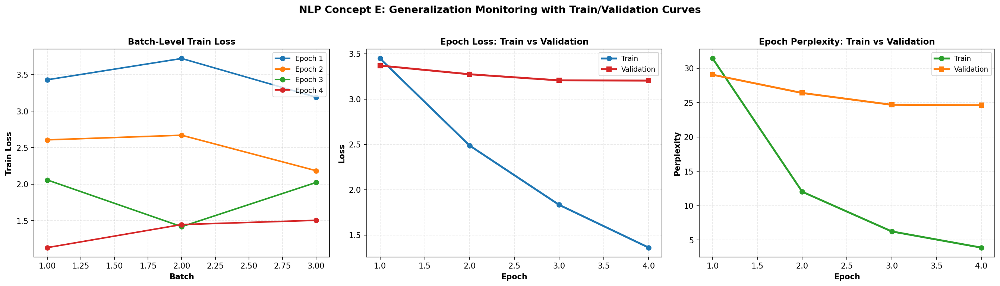

# LLM From Scratch: Finetuning, Alignment, and Evaluation

[](https://www.python.org/)
[](#learning-path)
[](#who-this-is-for)

Learn LLMs from scratch with a practical path from transformer basics to finetuning, evaluation, DPO, RLHF, and alignment data pipelines.

This repository is designed for engineers, students, and interview-prep learners who want a structured, code-first path into modern LLM systems without skipping the fundamentals.

Keywords: LLM from scratch, transformer, tokenization, instruction tuning, LoRA, QLoRA, DPO, RLHF, alignment, preference data, Ollama, evaluation design, GenAI interview preparation.

## Why This Repo

Most LLM learning resources do one of two things poorly:

- They stay too theoretical and never show runnable code.
- They jump straight to large-scale tooling without building intuition.

This repo takes a different approach:

- Start with foundations.
- Build intuition with small educational scripts.
- Move into practical finetuning methods.
- Learn evaluation like a senior engineer.
- Learn alignment methods such as DPO and RLHF with simple but useful examples.

The main study guide is [finetuning.md](./finetuning.md).

## Who This Is For

- Engineers learning LLM finetuning from first principles
- Developers preparing for GenAI or LLM engineer interviews
- Practitioners who want intuition before using heavyweight frameworks
- Learners who want to understand LoRA, QLoRA, DPO, RLHF, and evaluation design in one place

## What You Will Learn

- Transformer and tokenization basics
- Instruction tuning and assistant-only loss masking
- Full finetuning vs PEFT methods
- LoRA, QLoRA, BitFit, Prefix Tuning, Soft Prompt Tuning, and Adapters
- Evaluation design, quality metrics, and release gates
- Preference data, DPO intuition, RLHF intuition, and alignment tradeoffs
- Practical local workflows using Ollama for preference judgment

## Learning Path

This repository follows the phased progression described in [finetuning.md](./finetuning.md).

### Phase 1: Build Foundations

Learn transformer basics, tokenization, attention, and training flow.

Files:
- [1_basic_foundations/tokenization.py](./1_basic_foundations/tokenization.py)
- [1_basic_foundations/advanced_tokenisation.py](./1_basic_foundations/advanced_tokenisation.py)
- [1_basic_foundations/attention_at_highlevel.py](./1_basic_foundations/attention_at_highlevel.py)
- [1_basic_foundations/transformer_basic.py](./1_basic_foundations/transformer_basic.py)
- [1_basic_foundations/transformer_basic_training_inference_pipeline.py](./1_basic_foundations/transformer_basic_training_inference_pipeline.py)

### Phase 2: Train a Very Small Text Model Conceptually

Understand forward pass, loss, backpropagation, and validation with small educational code.

Recommended entry:
- [1_basic_foundations/transformer_basic_training_inference_pipeline.py](./1_basic_foundations/transformer_basic_training_inference_pipeline.py)

### Phase 3: Learn Instruction Tuning

Move from next-token prediction to prompt-response finetuning.

Files:
- [2_3_4_full_finetuning/instruction_tuning_basic.py](./2_3_4_full_finetuning/instruction_tuning_basic.py)
- [2_3_4_full_finetuning/instruction_tuning_with_visual.py](./2_3_4_full_finetuning/instruction_tuning_with_visual.py)

Includes visual artifacts for:
- token/label masking
- teacher forcing intuition
- embedding shifts
- attention changes
- learning curves

### Phase 4: Learn LoRA and QLoRA

Understand modern practical finetuning methods and PEFT tradeoffs.

Main file:
- [2_3_4_full_finetuning/modern_finetuning.py](./2_3_4_full_finetuning/modern_finetuning.py)

Methods covered:
- Full finetuning
- BitFit
- LoRA
- QLoRA
- Prefix Tuning
- Soft Prompt Tuning
- Adapters

### Phase 5: Learn Evaluation Design

Learn how senior engineers evaluate models beyond training loss.

Main file:
- [5_LLM_usecase_design_pattern/phase5_evaluation_demo.py](./5_LLM_usecase_design_pattern/phase5_evaluation_demo.py)

Topics covered:
- baseline vs candidate comparison
- task quality metrics
- hallucination proxy checks
- latency and operational constraints
- release gate thinking

### Phase 6: Learn Alignment Methods

Understand what comes after SFT and how preference-based alignment works.

Folder:
- [6_alignment_methods](./6_alignment_methods)

Key files:
- [6_alignment_methods/step1_preference_dataset_basics.py](./6_alignment_methods/step1_preference_dataset_basics.py)
- [6_alignment_methods/step2_dpo_intuition.py](./6_alignment_methods/step2_dpo_intuition.py)
- [6_alignment_methods/step3_rlhf_intuition.py](./6_alignment_methods/step3_rlhf_intuition.py)
- [6_alignment_methods/step4_preference_dataset_pipeline.py](./6_alignment_methods/step4_preference_dataset_pipeline.py)
- [6_alignment_methods/step5_ollama_preference_judge.py](./6_alignment_methods/step5_ollama_preference_judge.py)
- [6_alignment_methods/README.md](./6_alignment_methods/README.md)

Topics covered:
- preference datasets
- annotator agreement
- DPO
- RLHF
- PPO-style intuition
- preference pipeline design
- Ollama-based local preference judging

### Phase 7: Learn System Design for LLM Applications

This phase is documented in [finetuning.md](./finetuning.md) and focuses on:

- RAG vs finetuning decisions
- guardrails
- monitoring
- rollback strategy
- quality/cost/latency tradeoffs

## Repository Structure

```text
.
├── 1_basic_foundations/
├── 2_3_4_full_finetuning/
├── 5_LLM_usecase_design_pattern/
├── 6_alignment_methods/
├── finetuning.md
└── tokenisation.md
```

## Start Here

If you are new, follow this order:

1. Read [finetuning.md](./finetuning.md) for the full roadmap.
2. Run scripts in [1_basic_foundations](./1_basic_foundations).
3. Move to [2_3_4_full_finetuning/instruction_tuning_basic.py](./2_3_4_full_finetuning/instruction_tuning_basic.py).
4. Study [2_3_4_full_finetuning/modern_finetuning.py](./2_3_4_full_finetuning/modern_finetuning.py).
5. Run [5_LLM_usecase_design_pattern/phase5_evaluation_demo.py](./5_LLM_usecase_design_pattern/phase5_evaluation_demo.py).
6. Work through [6_alignment_methods/README.md](./6_alignment_methods/README.md).

## Quick Run Examples

Run from the repository root.

```bash
python 1_basic_foundations/transformer_basic.py
python 2_3_4_full_finetuning/instruction_tuning_basic.py
python 2_3_4_full_finetuning/modern_finetuning.py
python 5_LLM_usecase_design_pattern/phase5_evaluation_demo.py
python 6_alignment_methods/step1_preference_dataset_basics.py
python 6_alignment_methods/step2_dpo_intuition.py
python 6_alignment_methods/step3_rlhf_intuition.py
python 6_alignment_methods/step4_preference_dataset_pipeline.py --make-sample
python 6_alignment_methods/step4_preference_dataset_pipeline.py
```

Example local Ollama preference generation:

```bash
python 6_alignment_methods/step5_ollama_preference_judge.py \
  --model-a qwen2.5:3b \
  --model-b qwen2.5:3b \
  --temp-a 0.2 \
  --temp-b 0.8 \
  --judge-model qwen2.5:3b \
  --temp-judge 0.1
```

## Visuals

Example DPO intuition chart:


Example learning-curve output from instruction tuning visuals:



## What Makes This Repo Different

- Educational but runnable
- Interview-friendly and engineering-focused
- Covers both finetuning and alignment
- Includes evaluation design, not only training
- Uses small scripts to build intuition before scaling up
- Includes local-model workflows with Ollama

## Study Guide and Interview Bank

The strongest companion document in this repository is [finetuning.md](./finetuning.md).

It includes:
- end-to-end finetuning lifecycle
- phase-based learning path
- evaluation framework
- alignment concepts
- Q&A bank from beginner to senior level
- concise revision material for interviews

## Suggested Audience Search Terms

If you found this repo useful, it is likely relevant to people searching for:

- llm from scratch
- llm finetuning tutorial
- lora qlora tutorial
- dpo vs rlhf
- alignment learning repo
- llm interview prep
- transformer basics python
- preference dataset pipeline

## Contributing

Issues and improvements are welcome, especially around:

- clearer educational explanations
- additional evaluation cases
- more alignment experiments
- better visualization and reproducibility

## License

Add a license file if you want to make reuse terms explicit.