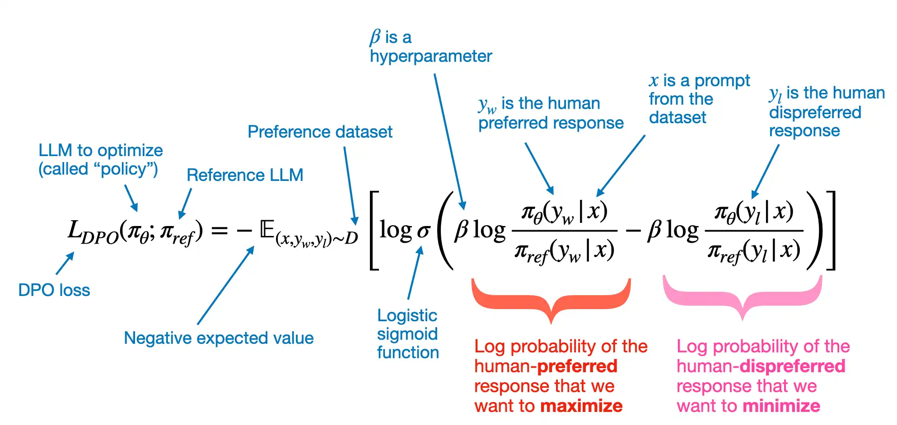

# LLM Finetuning Study Guide

This document is a step-by-step learning path for LLM finetuning, written to help with senior-level interview preparation. It combines concepts, practical workflow, tradeoffs, and interview-style questions with strong answers.

---

## 1. What finetuning means

Finetuning is the process of adapting a pretrained model to perform better on a narrower task, domain, style, or behavior than it learned during general pretraining.

Examples:
- Teaching a general model to answer insurance policy questions.
- Teaching a model to follow a specific response format.
- Teaching a model to use domain terminology such as legal or medical language.
- Teaching a model to prefer high-quality answers over weak ones.

A strong interview answer:

**Question:** What is the difference between pretraining and finetuning?

**Answer:**
Pretraining teaches the model broad language and world knowledge from very large-scale corpora using a self-supervised objective such as next-token prediction. Finetuning specializes that pretrained model for a narrower objective, such as instruction following, domain adaptation, classification, or preference alignment, using a smaller and more curated dataset. Pretraining builds general capability; finetuning shapes behavior and task performance.

---

## 2. The big picture: finetuning pipeline

A senior engineer should be able to explain the end-to-end lifecycle:

1. Define the business goal.
2. Translate the goal into a training objective.
3. Collect and clean data.
4. Choose a base model.
5. Choose a finetuning strategy.
6. Format the data correctly.
7. Train with the right hyperparameters.
8. Evaluate with offline and human metrics.
9. Debug failure modes.
10. Deploy, monitor, and iterate.

A strong interview answer:

**Question:** How do you approach an LLM finetuning project end to end?

**Answer:**
I start by defining the target behavior and measurable success criteria. Then I determine whether the problem actually requires finetuning or whether prompt engineering, retrieval, or tool use is sufficient. If finetuning is justified, I design a high-quality dataset, choose an appropriate base model and tuning method such as LoRA or full finetuning, train with careful validation checkpoints, evaluate both quality and safety, and only then move to deployment. In production I monitor drift, latency, cost, and quality regressions, and I treat the dataset and evaluation suite as versioned assets.

---

## 3. Step 1: Decide whether you really need finetuning

Many interviewers ask this because senior engineers should avoid expensive solutions when simpler ones work.

Use prompt engineering when:
- The task is mostly formatting or instruction clarity.
- The knowledge already exists in the base model.
- You can get the behavior you need with a better system prompt.

Use retrieval-augmented generation when:
- The problem is mainly missing or changing knowledge.
- You need answers grounded in private or frequently updated documents.
- Hallucination risk must be reduced with citations or source grounding.

Use finetuning when:
- You need stable behavior across many prompts.
- You need a specific answer style, schema, or reasoning pattern.
- You need better performance on domain-specific instructions.
- You want to reduce prompt length and inference cost by baking behavior into weights.
- You want the model to learn patterns from examples rather than relying only on context.

A strong interview answer:

**Question:** When should you not finetune an LLM?

**Answer:**
I would avoid finetuning if the real problem is fresh knowledge, because retrieval is usually the correct solution there. I would also avoid it when prompt engineering already gets the required quality, because finetuning adds operational complexity and evaluation burden. Finetuning is best when the behavior change is systematic, repeatable, and learnable from examples.

---

## 4. Step 2: Understand the major types of finetuning

### 4.1 Supervised finetuning (SFT)

This is the most common starting point.

You train on prompt-response pairs:
- Input: user instruction or conversation context
- Target: ideal assistant response

Use SFT when:
- You have examples of good answers.
- You want instruction following.
- You want domain-specific assistant behavior.

### 4.2 Parameter-efficient finetuning (PEFT)

Instead of updating all model weights, you update a small subset or small adapter layers.

Common PEFT methods:
- LoRA
- QLoRA
- Adapters
- Prefix tuning

Why PEFT matters:
- Much lower GPU memory usage
- Faster training
- Easier storage and deployment of multiple task adapters

### 4.3 Full finetuning

You update all weights.

Use only when:
- You have enough compute.
- The task justifies the cost.
- You need maximum adaptability.
- The model is small enough or the use case is very important.

### 4.4 Preference tuning / alignment

After SFT, teams often improve quality with preference data.

Examples:
- RLHF
- DPO
- ORPO
- PPO-based alignment pipelines

Use when:
- You want the model to prefer better answers among alternatives.
- You want improved helpfulness, harmlessness, or style consistency.

A strong interview answer:

**Question:** What is the difference between SFT and preference tuning?

**Answer:**
SFT teaches the model to imitate ideal responses directly from labeled prompt-response pairs. Preference tuning teaches the model which of several candidate outputs is preferred, which is useful when quality is comparative rather than absolute. In practice, SFT establishes the base behavior and preference tuning refines the ranking of outputs.

---

## 5. Step 3: Learn LoRA and QLoRA deeply

These are extremely common in interviews.

### 5.1 What LoRA does

LoRA stands for Low-Rank Adaptation.

Instead of changing a large weight matrix W directly, LoRA learns a low-rank update:

W' = W + DeltaW

where DeltaW is approximated by two much smaller matrices.

Why this helps:
- Fewer trainable parameters
- Lower memory use
- Faster experimentation
- Easier adapter storage

### 5.2 What QLoRA adds

QLoRA combines:
- Quantized base model weights, often 4-bit
- LoRA adapters on top of the quantized model

Why it matters:
- Makes larger models trainable on smaller hardware
- Retains strong quality relative to memory cost

Tradeoff:
- Slightly more training complexity
- Quantization and optimizer setup must be correct

A strong interview answer:

**Question:** Why is LoRA so popular in production-oriented finetuning?

**Answer:**
LoRA offers a very strong quality-to-cost ratio. It lets teams adapt large models without retraining all weights, which reduces memory, storage, and experiment cost. It is especially attractive when a platform needs multiple domain-specific variants of the same base model, because each adapter is small and easy to manage.

**Question:** What is the difference between LoRA and QLoRA?

**Answer:**
LoRA applies low-rank trainable adapters to a standard base model. QLoRA adds quantization to the base model, typically 4-bit, while still training the adapter layers in higher precision. That reduces memory further and enables finetuning larger models on limited hardware.

---

## 6. Step 4: Data is the real project

Senior interviewers expect this answer: model tuning is often easier than building a good dataset.

### 6.1 What good finetuning data looks like

Good data is:
- Relevant to the target task
- Correct and internally consistent
- Diverse enough to cover realistic cases
- Balanced across difficulty and user types
- Free from leakage, duplicates, and obvious label noise

### 6.2 Common dataset formats

Instruction tuning dataset:

```json
{
  "messages": [
    {"role": "system", "content": "You are a finance assistant."},
    {"role": "user", "content": "Explain EBITDA in simple terms."},
    {"role": "assistant", "content": "EBITDA is a measure of operating performance..."}
  ]
}
```

Prompt-completion dataset:

```json
{
  "prompt": "Summarize this support ticket:",
  "completion": "The user cannot reset their password because..."
}
```

Preference dataset:

```json
{
  "prompt": "Answer the customer complaint.",
  "chosen": "I understand the issue and here is the fix...",
  "rejected": "That is not our problem."
}
```

### 6.3 Data preparation checklist

1. Remove exact and near duplicates.
2. Normalize formatting.
3. Validate schema.
4. Remove unsafe, irrelevant, or contradictory examples.
5. Ensure train, validation, and test splits are clean.
6. Keep hard examples in validation.
7. Version the dataset.

A strong interview answer:

**Question:** What matters more, model size or data quality?

**Answer:**
For most finetuning projects, data quality matters more than chasing a slightly larger model. A noisy or misaligned dataset can actively damage performance, while a smaller but well-chosen dataset often produces meaningful gains. Senior-level judgment is mostly about data design, evaluation, and failure analysis rather than just launching a training job.

**Question:** What are common data issues in finetuning projects?

**Answer:**
The most common issues are label noise, duplicated examples, train-test leakage, inconsistent formatting, and overrepresentation of easy examples. Another major issue is objective mismatch, where the dataset teaches behavior that does not actually match the production requirement.

---

## 7. Step 5: Choose the right base model

Your base model decision should consider:
- Task type
- Context length
- License constraints
- Inference cost
- Latency target
- Available GPUs
- Language support
- Safety and compliance requirements

A strong interview answer:

**Question:** How do you choose a base model for finetuning?

**Answer:**
I optimize for the smallest model that can meet quality requirements after adaptation, because deployment cost matters. I look at benchmark relevance, context window, tokenizer behavior, ecosystem support, and whether the model is known to respond well to SFT or LoRA-based adaptation. I also consider licensing and operational constraints early, because a technically good model is not enough if it cannot be shipped.

---

## 8. Step 6: Tokenization and sequence construction

This is a common senior-level discussion area because it affects both quality and cost.

### 8.1 Context length (context window)

Context length is the maximum number of tokens the model can process in a single request.

What fits inside this token budget:
- System instructions
- User prompt
- Conversation history
- Retrieved documents
- Model output tokens

Why it matters:
- If input is too long, some content is truncated.
- Truncation can remove critical instructions or evidence.
- Longer contexts increase compute and memory cost.
- Long context quality can degrade if attention is not effective across the whole sequence.

Senior interview framing:
Context length is the model's working-memory budget for one inference pass, and practical system design is about deciding what to include, what to summarize, and what to retrieve on demand.

Key concepts:
- Tokenizer converts text into token IDs.
- Sequence length affects memory quadratically in standard attention.
- Truncation can silently remove critical instruction or answer content.
- Packing multiple short examples can improve training efficiency.

Important detail:
For chat finetuning, you often train only on assistant tokens and mask user/system tokens from the loss, depending on the objective and framework.

A strong interview answer:

**Question:** Why does sequence construction matter in finetuning?

**Answer:**
Because the model only learns from the tokens and loss mask you actually feed it. If the conversation template is wrong, the truncation policy is poor, or the loss is applied to the wrong parts of the sequence, the model can learn incorrect patterns. Sequence construction is not preprocessing trivia; it is part of the learning objective.

---

## 9. Step 7: Training fundamentals you must know

### 9.1 Main training concepts

- Batch size
- Gradient accumulation
- Learning rate
- Warmup steps
- Weight decay
- Epochs
- Max sequence length
- Optimizer choice
- Mixed precision
- Checkpointing

### 9.2 Common behavior of hyperparameters

Learning rate:
- Too high: unstable training, catastrophic forgetting, poor generalization
- Too low: slow learning, underfitting

Batch size:
- Larger effective batch can stabilize gradients
- Smaller batch can add noise but sometimes generalizes well

Epochs:
- Too many epochs on narrow data can cause overfitting

A strong interview answer:

**Question:** What is catastrophic forgetting in finetuning?

**Answer:**
Catastrophic forgetting happens when finetuning causes the model to lose useful general capabilities from pretraining because the update is too aggressive or the dataset is too narrow. It often shows up when learning rates are too high, training runs too long, or the dataset distribution is overly concentrated. PEFT methods and careful hyperparameter control help reduce this risk.

**Question:** Why do we use gradient accumulation?

**Answer:**
Gradient accumulation lets us simulate a larger effective batch size when GPU memory is limited. Instead of updating parameters on every micro-batch, we accumulate gradients over several forward and backward passes and then perform one optimizer step.

---

## 10. Step 8: Evaluation is where seniority shows

A weak candidate talks only about training loss. A strong candidate talks about evaluation design.

### 10.1 Offline evaluation

Examples:
- Exact match
- F1
- ROUGE or BLEU for constrained tasks
- Structured output accuracy
- Tool-call correctness
- Hallucination rate
- Safety violations
- Human preference win rate

Notes on ROUGE and BLEU:
- BLEU [ Bilingual Evaluation Understudy ] measures n-gram precision overlap between model output and reference text.
- ROUGE [Recall-Oriented Understudy for Gisting Evaluation] focuses more on recall-style overlap and sequence coverage, often used in summarization.
- These metrics are most useful for constrained tasks where valid wording is narrow, such as translation or tightly scoped summaries.
- For open-ended assistant tasks, use them carefully and combine them with human evaluation and task-specific checks.

### 10.2 Domain evaluation

For enterprise use cases, build a custom eval set:
- Realistic prompts
- Edge cases
- Adversarial prompts
- Long-context cases
- Multi-turn cases
- Compliance-sensitive examples

### 10.3 Human evaluation

Needed when:
- Multiple outputs can be acceptable
- Tone matters
- Helpfulness matters
- Faithfulness matters

A strong interview answer:

**Question:** Why is training loss not enough?

**Answer:**
Training loss is only a proxy for how well the model fits the training objective. It does not guarantee production usefulness, factuality, safety, or user satisfaction. A senior evaluation strategy combines benchmark-style metrics, task-specific automated checks, and human review of realistic failure cases.

**Question:** How would you build an eval suite for a customer support assistant?

**Answer:**
I would define scenarios such as refund questions, policy explanations, frustrated users, ambiguous requests, escalation boundaries, and out-of-scope prompts. Then I would score response correctness, tone, compliance, resolution quality, and whether the model stays within policy. I would include adversarial prompts and compare against both the base model and previous tuned versions.

---

## 11. Step 9: Common failure modes and debugging

### 11.1 Overfitting

Symptoms:
- Validation performance stops improving
- Model becomes too narrow or repetitive
- Strong performance on training-like prompts, weak generalization elsewhere

Fixes:
- Better data variety
- Fewer epochs
- Lower learning rate
- Stronger validation process

### 11.2 Mode collapse or repetitive outputs

Symptoms:
- Same template every answer
- Overly short or overly safe outputs

Fixes:
- Increase output diversity in data
- Improve data balance
- Check loss masking and formatting

### 11.3 Instruction drift

Symptoms:
- Model ignores key system constraints
- Model answers in the wrong format

Fixes:
- Align training examples with desired instruction format
- Ensure conversation templates match inference templates

### 11.4 Hallucination persists after finetuning

Important lesson:
Finetuning does not reliably solve missing knowledge.

Fix:
Use retrieval or tools for grounding.

A strong interview answer:

**Question:** Can finetuning eliminate hallucinations?

**Answer:**
No. Finetuning can reduce some behavior issues, improve style, and teach the model to abstain more often, but it is not a reliable fix for missing or changing knowledge. If the requirement is factual grounding against external documents, retrieval or tool use is the stronger architectural solution.

---

## 12. Step 10: Senior-level tradeoffs

These are the kinds of comparisons often discussed in interviews.

### 12.1 Finetuning vs RAG

Finetuning is better for:
- Behavior shaping
- Format control
- Domain style adaptation
- Compact prompts

RAG is better for:
- Fresh knowledge
- Private documents
- Evidence-backed responses
- Reduced factual drift

### 12.2 LoRA vs full finetuning

LoRA is better for:
- Cost efficiency
- Fast iteration
- Multi-adapter strategy

Full finetuning is better for:
- Maximum model adaptation when compute budget allows
- Cases where adapter-only changes are insufficient

### 12.3 Smaller tuned model vs larger untuned model

A smaller tuned model can win when:
- Domain is narrow
- Latency matters
- Output format must be stable
- Cost matters heavily

A strong interview answer:

**Question:** Would you choose a larger base model with prompting or a smaller model with finetuning?

**Answer:**
It depends on cost, latency, and domain specificity. For a narrow enterprise workflow, a smaller tuned model can outperform a larger general model in practical terms because it is cheaper, faster, and more consistent. I would validate the choice empirically with a production-like evaluation set instead of assuming the larger model will always win.

---

## 13. Step 11: Production considerations

Finetuning is not finished when the loss curve looks good.

Production concerns:
- Model registry and versioning
- Dataset versioning
- Reproducibility
- Safety filters
- Rollback strategy
- A/B testing
- Drift monitoring
- Cost tracking
- Latency tracking
- Adapter management

A strong interview answer:

**Question:** What would you monitor after deploying a finetuned model?

**Answer:**
I would monitor task success metrics, user feedback, latency, token usage, error rate, refusal quality, hallucination rate, and safety incidents. I would also track distribution drift in prompts and periodically re-run the evaluation suite because a model can degrade in practical quality even if the infrastructure remains healthy.

---

## 14. Step 12: A practical hands-on progression for learning

If you want to learn in the right order, do this:

### Phase 1: Build foundations

Learn these first:
- Transformer basics
- Tokens and tokenization
- Attention at a high level
- Next-token prediction
- Cross-entropy loss
- Overfitting and generalization
- Precision formats such as fp16 and bf16

### Phase 2: Train a very small text model conceptually

Goal:
Understand the training loop before touching large models.

Learn:
- Forward pass
- Loss computation
- Backpropagation
- Optimizer step
- Validation loop

### Phase 3: Learn instruction tuning

Goal:
Understand prompt-response finetuning.

Focus on:
- Chat template formatting
- Assistant-only loss masking
- Train/validation splits
- Hyperparameter basics

### Phase 4: Learn LoRA and QLoRA

Goal:
Understand practical modern finetuning.

Focus on:
- Rank
- Target modules
- Quantization
- Memory savings
- Adapter merging and storage

### Phase 5: Learn evaluation design

Goal:
Think like a senior engineer.

Focus on:
- Custom eval datasets
- Human review criteria
- Error categorization
- Comparison against baseline models

Practical Evaluation Template (use this in projects and interviews):

1. Define objective and success criteria
- Product objective: What behavior must improve?
- Primary success metric: What single metric matters most?
- Constraints: max latency, max cost/request, safety threshold.

Template:
- Objective: Improve domain-specific response correctness for support workflow.
- Primary metric: Task Success Rate >= 85% on gold eval set.
- Constraints: p95 [95th percentile response time] latency <= 2.0s, hallucination rate <= 5%, refusal error <= 2%.

2. Build a representative evaluation set
- Keep evaluation data separate from training data.
- Include realistic prompts, hard edge cases, and adversarial prompts.
- Tag each sample by slice (easy, hard, long-context, safety-critical, etc.).

Recommended split for first version (example 200 samples):
- 120 normal production-like cases
- 50 hard/edge cases
- 30 adversarial or policy-sensitive cases

3. Track a balanced metric stack

Use this scorecard:

| Metric | Why it matters | Example target |
|---|---|---|
| Task Success Rate | Core business quality | >= 85% |
| Structured Format Accuracy | Reliability for downstream systems | >= 95% |
| Hallucination Rate | Factual trustworthiness | <= 5% |
| Human Preference Win Rate vs baseline | Overall usefulness and tone | >= 55% |
| p95 Latency | User experience | <= 2.0s |
| Cost per 1k requests | Production efficiency | within budget |

4. Use a consistent human review rubric

Score each response from 1 to 5 on:
- Correctness
- Completeness
- Clarity
- Policy/Safety compliance
- Tone and professionalism

Pairwise protocol (recommended):
- Compare Model A vs Model B on same prompt.
- Blind the model identity.
- Record winner and reason.

5. Run baseline comparisons every time
- Compare at least these models:
  1. Base model (no finetune)
  2. Current production model
  3. New candidate finetuned model

Golden rule:
- Never declare success from absolute numbers alone.
- Improvement must be shown against baseline and previous best.

6. Use an error taxonomy for debugging

Label each failed sample with one primary error type:
- Factual error
- Instruction non-compliance
- Format/schema violation
- Hallucination/unsupported claim
- Safety/policy violation
- Over-refusal or under-refusal
- Retrieval grounding miss (if RAG-assisted)

Then report top failure buckets with counts and percentages.

7. Add release gates (ship/no-ship criteria)

Example release gate checklist:
- [ ] Task Success Rate improved by >= 3 points vs production baseline.
- [ ] Hallucination Rate not worse than baseline.
- [ ] Safety violation rate below threshold.
- [ ] p95 latency and cost remain within budget.
- [ ] No critical regressions in high-risk slices.

8. Report results like a senior engineer

Use this summary structure:
- What changed (dataset, method, hyperparameters)
- What improved (with exact numbers)
- What regressed (with slice-level detail)
- Decision (ship, hold, or iterate)
- Next actions (data fixes, method changes, additional eval slices)

Interview-ready one-liner:
- "Evaluation design means defining objective-aligned metrics, stress-testing with representative slices, comparing against baselines, and making release decisions with explicit quality, safety, latency, and cost gates."

### Phase 6: Learn alignment methods

Goal:
Understand what comes after SFT.

Focus on:
- Preference datasets
- DPO intuition
- RLHF intuition
- Helpfulness vs safety tradeoffs

Step-by-step roadmap (beginner -> senior):

Step 1: Build alignment intuition first
- SFT teaches "how to answer" from demonstrations.
- Alignment methods teach "which answer is preferred" among alternatives.
- Think of alignment as ranking quality, not only imitation.

Step 2: Learn preference dataset design
- Core format: prompt, chosen response, rejected response.
- Understand labeling criteria:
  - correctness
  - helpfulness
  - safety/policy compliance
  - style/tone
- Include hard negatives (plausible but subtly wrong outputs).
- Avoid leakage and annotator inconsistency.

Step 3: Learn DPO intuition deeply
- DPO (Direct Preference Optimization) avoids full RL loops.
- It directly increases probability of chosen response and decreases rejected response relative to a reference policy.
- Why teams like DPO:
  - simpler training pipeline than PPO-RLHF
  - stable and practical for many real products
  - strong quality improvement after SFT

Step 4: Learn RLHF intuition (without getting lost in complexity)
- RLHF pipeline at high level:
  1. Train SFT model
  2. Train reward model from preference data
  3. Optimize policy against reward (often PPO-style)
- Understand why RLHF is powerful:
  - can optimize behavior not easily captured by token-level supervised loss
- Understand why RLHF is hard:
  - reward hacking
  - instability and hyperparameter sensitivity
  - higher engineering cost

Step 5: Learn objective and regularization concepts
- Reference model anchoring (KL penalty / implicit regularization) prevents policy drift.
- Distribution shift risk: preference data is usually narrow compared to production traffic.
- Over-optimization risk: model chases proxy reward and loses general behavior quality.

Step 6: Learn evaluation for alignment specifically
- Evaluate more than average quality:
  - preference win rate vs SFT baseline
  - refusal quality (over-refusal vs under-refusal)
  - policy violation rate
  - hallucination and factual faithfulness
  - long-context and adversarial slice robustness
- Keep red-team and safety eval sets separate from training preference data.

Step 7: Learn helpfulness vs safety tradeoff management
- Too much helpfulness bias -> unsafe compliance risk.
- Too much safety bias -> unnecessary refusals and poor user utility.
- Senior approach:
  - define policy boundaries explicitly
  - tune refusal behavior with targeted preference examples
  - evaluate both task success and safety metrics together

Step 8: Learn senior-level production concepts
- Constitutional/spec-driven alignment:
  - encode policy principles and auditing criteria
- Data governance:
  - labeler guidelines, adjudication, inter-annotator agreement
- Monitoring:
  - preference drift, refusal drift, safety incident trends
- Rollback and iteration:
  - keep baseline SFT and previous aligned checkpoints for fast recovery

General concepts to include for senior GenAI engineer/researcher understanding:
- Reward misspecification: optimizing the wrong proxy can degrade real quality.
- Goodhart's law in alignment: when a metric becomes a target, it can stop being a good metric.
- Distributional robustness: aligned behavior should hold across domain, language, and prompt-style shifts.
- Calibration and uncertainty: model should know when to abstain or request clarification.
- Multi-objective optimization: quality, safety, latency, and cost must be balanced.
- Human factors: annotation quality and policy clarity often dominate algorithm choice.
- Offline vs online alignment: offline preference gains may not transfer fully to live traffic.
- Alignment tax: some safety gains can reduce raw utility; quantify and manage deliberately.

Practical implementation order (recommended):
1. Start with strong SFT baseline and eval suite.
2. Build small, high-quality preference dataset with clear rubric.
3. Run DPO first (fast, practical baseline).
4. Compare against SFT on quality and safety slices.
5. If needed, scale to reward-model + RLHF loop.
6. Add monitoring and rollback policy before production rollout.

Interview-ready one-liner:
- "After SFT, alignment methods optimize preference-level behavior. Senior practice is not only choosing DPO or RLHF, but designing preference data, controlling policy drift, measuring helpfulness-safety tradeoffs, and shipping with robust safety evaluation and monitoring."

### Phase 7: Learn system design for LLM applications

Goal:
Answer senior-level architecture questions.

Focus on:
- RAG vs finetuning
- Guardrails
- Monitoring
- Cost-performance tradeoffs
- Deployment patterns

Step-by-step roadmap (beginner -> senior):

Step 1: Frame the problem as a system, not only a model
- Define user journey, failure impact, latency budget, and cost budget.
- Clarify what must be deterministic vs probabilistic.
- Separate model quality from product quality (UX, fallback behavior, reliability).

Step 2: Choose the right architecture pattern
- Prompt-only baseline (fastest to test).
- RAG pipeline (best when knowledge freshness matters).
- Finetuned model (best when behavior/style must be stable).
- Hybrid (common in production): finetuned behavior + retrieval grounding + tools.

Decision heuristic:
1. Knowledge changes frequently -> prioritize RAG.
2. Behavior consistency matters most -> finetuning helps.
3. Workflow needs external actions -> tool-calling/agent orchestration.
4. High-stakes domain -> add strict guardrails and human escalation paths.

Step 3: Design the request pipeline explicitly
- Typical path:
1. Input validation and normalization
2. Safety pre-check
3. Retrieval/tool routing
4. Prompt construction
5. Generation
6. Safety and policy post-check
7. Structured output validation
8. Logging and telemetry

Senior principle:
- Keep each stage observable and independently testable.

Step 4: Design data and retrieval layer
- Document ingestion with chunking + metadata.
- Embedding/indexing strategy.
- Retrieval quality tuning (top-k, reranking, filtering).
- Source attribution and citation policy.
- Freshness and re-index SLAs.

Common failure modes to monitor:
- stale documents
- poor chunk boundaries
- missing metadata filters
- retrieval drift across domains

Step 5: Build safety and policy guardrails
- Input guardrails: prompt injection, unsafe requests, data exfiltration attempts.
- Output guardrails: harmful content, policy violation, schema non-compliance.
- Refusal quality control: avoid both over-refusal and under-refusal.
- Human-in-the-loop fallback for high-risk or low-confidence outputs.

Step 6: Design multi-model and fallback strategy
- Primary model for best quality.
- Secondary model for resilience or cost-control.
- Rules for timeout fallback and degradation mode.
- Cache strategy for repeated requests.

Production pattern:
- Route by intent/risk tier rather than sending all traffic to one large model.

Step 7: Define evaluation and release gates for system behavior
- Offline eval set by slices: normal, edge, adversarial, long-context, safety-critical.
- Online metrics: success rate, escalation rate, policy violation rate, latency p95, cost/request.
- Regression gates before rollout.
- Canary and rollback plans.

Step 8: Operability and governance
- Prompt/template versioning.
- Dataset/index versioning.
- Model and adapter version tracking.
- Audit logs for decisions and tool calls.
- Incident response playbook for safety or reliability failures.

Reference architecture (practical):
1. API Gateway
2. Policy + Auth layer
3. Orchestrator (routing + prompt building)
4. Retrieval service (vector + metadata filters)
5. Model inference layer (primary + fallback)
6. Guardrail service (pre/post checks)
7. Observability stack (metrics, traces, eval feedback)

Senior interview language you can use:
- "I design LLM applications as reliability-critical systems, not single-model demos."
- "I define architecture by objective, risk class, and latency/cost constraints first, then choose model strategy."
- "I separate behavior shaping, knowledge grounding, and action execution into explicit layers with observability."
- "I require release gates on quality, safety, latency, and cost before scaling traffic."

System design checklist (ship readiness):
- [ ] Problem objective and constraints are explicit
- [ ] Architecture choice justified (RAG/finetune/hybrid)
- [ ] Guardrails implemented and tested
- [ ] Retrieval quality and freshness validated
- [ ] Fallback and rollback paths tested
- [ ] Online monitoring dashboards and alerts live
- [ ] Incident playbook and ownership defined

Interview-ready one-liner:
- "Senior LLM system design is the disciplined integration of model behavior, retrieval grounding, guardrails, and operational controls under explicit quality, safety, latency, and cost objectives."

---

## 15. Interview question bank with strong answers

### Q1. What problem does finetuning solve?

Finetuning solves the problem of adapting a general pretrained model to a specific target behavior, domain, or task using curated examples. It is most useful when the desired behavior is systematic and repeatable rather than a one-off prompting trick.

### Q2. What is supervised finetuning?

Supervised finetuning is training the model on labeled prompt-response pairs so it learns to produce desired outputs for given inputs. It is the standard starting point for instruction-following assistants.

### Q3. What is PEFT and why is it important?

PEFT means parameter-efficient finetuning. Instead of updating every model weight, it updates only a small number of parameters, which reduces GPU memory, training time, and storage. It is important because it makes practical finetuning accessible and scalable in production teams.

### Q4. Explain LoRA in simple terms.

LoRA freezes the original model weights and learns a small low-rank update that modifies the model's behavior. It is popular because it captures useful adaptation with much lower cost than full finetuning.

### Q5. What is QLoRA?

QLoRA is LoRA on top of a quantized base model, usually 4-bit. It significantly reduces memory consumption while keeping trainable adapters in a higher-precision form.

### Q6. What are the risks of full finetuning?

The risks are high compute cost, larger memory requirements, longer iteration cycles, more operational complexity, and greater risk of catastrophic forgetting when the dataset is narrow or the training setup is aggressive.

### Q7. What is catastrophic forgetting?

It is when the model loses useful general capabilities from pretraining because finetuning pushes it too strongly toward a narrower distribution. It is a major concern when the finetuning dataset is small, repetitive, or poorly balanced.

### Q8. How do you prevent overfitting during finetuning?

Use a clean validation set, monitor evaluation metrics rather than only training loss, reduce learning rate when necessary, avoid too many epochs, improve data diversity, and keep a strong baseline comparison against the original model.

### Q9. Why is data curation more important than people think?

Because the model learns exactly the behavior present in the examples. If the dataset is noisy, inconsistent, or misaligned with the business objective, the finetuned model will amplify those issues. Strong outcomes usually come from strong data design, not just stronger hardware.

### Q10. How would you evaluate a finetuned model?

I would use a layered evaluation strategy: automated metrics where appropriate, custom task-specific benchmarks, adversarial and edge-case tests, and human evaluation for quality dimensions like helpfulness, tone, and factuality.

### Q11. When would you choose RAG over finetuning?

When the problem is about accessing current, private, or evidence-backed knowledge. RAG is a better fit for information access, while finetuning is a better fit for behavior shaping.

### Q12. Can finetuning teach a model new knowledge?

It can statistically reinforce patterns from the training set, but it is not the right mechanism for dependable, up-to-date factual knowledge injection. For knowledge that changes or must be traceable, retrieval is more reliable.

### Q13. What are the most important hyperparameters in finetuning?

Learning rate, effective batch size, number of epochs or steps, sequence length, optimizer, warmup schedule, and LoRA-specific settings such as rank and target modules. These influence stability, quality, and risk of forgetting.

### Q14. Why does the prompt format used in training matter?

Because the model learns from the exact token structure it sees. If the chat template or role markers differ between training and inference, behavior can degrade significantly.

### Q15. What is context length?

Context length is the total token window available in one model call. It includes instructions, prompt, history, retrieved context, and generated output. If that token budget is exceeded, content is truncated or must be summarized, which can hurt quality.

### Q16. What does a senior-level finetuning engineer do differently?

A senior engineer spends less time blindly training and more time defining the objective, designing data, building evaluations, analyzing failures, understanding tradeoffs, and ensuring the solution is viable in production.

### Q17. How would you explain DPO at a high level?

Direct Preference Optimization trains the model to prefer chosen outputs over rejected outputs without using a full reinforcement learning loop. It is simpler than classic RLHF pipelines and is often easier to operationalize.

### Q18. Why might a smaller finetuned model beat a larger untuned model?

Because domain alignment and output consistency often matter more than raw general capability in narrow tasks. A smaller model tuned on high-quality domain examples can be faster, cheaper, and more reliable for a specific workflow.

### Q19. What deployment pattern is common with LoRA adapters?

Teams often keep one shared base model and load task-specific adapters as needed. This reduces storage duplication and makes it easier to serve multiple specialized variants.

### Q20. What would make you reject a finetuning project proposal?

I would challenge it if the root problem is actually missing knowledge, poor retrieval, weak prompting, or undefined success criteria. I would also reject it if there is no credible plan for data quality and evaluation.

### Q21. What is the difference between instruction tuning and domain adaptation?

Instruction tuning teaches the model how to follow user requests well. Domain adaptation emphasizes performing better in a particular domain, often by learning terminology, style, and task patterns from that domain. In practice, many real projects combine both.

### Q22. What are ROUGE and BLEU, and when are they most useful?

ROUGE and BLEU are overlap-based metrics that compare generated text with reference answers. BLEU is more precision-oriented on n-gram overlap and is common in translation; ROUGE emphasizes recall and sequence overlap and is common in summarization. They are most useful for constrained tasks where expected outputs are narrow. For open-ended assistant tasks, they should be combined with human evaluation and task-specific checks.

### Q23. What is hallucination and what is hallucination rate?

Hallucination is when an LLM generates information that is incorrect, unsupported by evidence, or fabricated but presented confidently. Hallucination rate is the percentage of evaluated outputs that contain at least one hallucination.

Formula:
$\text{Hallucination Rate} = \frac{\#\text{responses with hallucination}}{\#\text{total responses evaluated}}$

Example:
If 18 out of 200 responses contain unsupported or fabricated claims, hallucination rate is 9%.

### Q24. What is human preference win rate?

Human preference win rate is the percentage of head-to-head comparisons where human evaluators prefer your model's answer over a baseline model's answer for the same prompt.

Formula:
$\text{Preference Win Rate} = \frac{\#\text{comparisons won}}{\#\text{total comparisons}}$

Example:
If evaluators compare 300 prompt pairs and prefer your model in 177 cases, the win rate is 59%.

### Q25. What are adapters in finetuning?

Adapters are small trainable modules inserted into each transformer layer while the original model weights stay frozen.

Detailed points:
- Purpose: Adapt a large base model to a new task or domain without full finetuning.
- Where they are added: Typically inside transformer blocks (for example after attention or feed-forward sublayers, depending on implementation).
- How they work: They project hidden states down to a smaller dimension and then back up, learning task-specific transformations with far fewer parameters.
- What stays fixed: The pretrained backbone weights are usually frozen.
- What gets trained: Only adapter parameters (and sometimes a small set of extra task-specific parameters).
- Why they are efficient: They reduce GPU memory, optimizer state size, and training time compared with updating all model weights.
- Deployment pattern: Keep one shared base model and swap adapters per task, tenant, or domain.
- Storage benefit: Each adapter checkpoint is much smaller than storing a full finetuned model copy.
- Quality tradeoff: Usually strong for many tasks, but sometimes full finetuning can still perform better on highly specialized objectives.
- Common risk: Mismatch between training and inference setup (wrong adapter loaded or wrong template) can cause quality drop.
- Practical use case: Multi-domain platforms that need many model variants at low cost.
- Relationship to LoRA: LoRA is a specific parameter-efficient adaptation method; both share the goal of training a small number of parameters instead of full model weights.

### Q26. What is a rollback strategy in LLM deployment?

A rollback strategy is a predefined plan to quickly revert from a newly deployed model (or adapter) to a previously stable version when quality, safety, latency, or reliability regressions are detected.

Detailed points:
- Purpose: Minimize user impact and business risk when a release performs worse than expected.
- Trigger conditions: Sudden rise in error rate, safety violations, hallucination rate, latency spikes, cost spikes, or user complaints.
- Rollback scope: Can target model version, adapter version, prompt template, retrieval configuration, or routing policy.
- Fast path: Keep last-known-good artifacts ready in a model registry so switching is immediate.
- Progressive release support: Use canary and staged rollout so only a small percentage of traffic is exposed before full release.
- Decision ownership: Define who can approve rollback (for example, on-call ML engineer or incident commander).
- Automation: Set alert thresholds and auto-rollback rules for critical metrics when safe to automate.
- Data and config versioning: Version datasets, prompts, adapters, and serving configs to make rollback deterministic.
- Validation after rollback: Confirm key metrics return to baseline and incident symptoms are resolved.
- Post-incident review: Identify root cause and update tests, eval suites, and release gates to prevent recurrence.

Interview-ready summary:
A senior rollback strategy is not just a manual undo button; it is an engineered safety mechanism with clear triggers, ownership, fast artifact switching, and verification steps.

### Q27. What is drift monitoring, and how do you do it?

Drift monitoring is the process of detecting when production inputs, outputs, or quality behavior shift away from what the model was trained and validated on.

Simple definition:
- Drift means the real-world data distribution changed.
- As drift grows, model quality can degrade even if infrastructure is healthy.

How to do drift monitoring (practical steps):
- Define baseline: Save reference distributions and metrics from training/validation and early stable production.
- Monitor input drift: Track prompt length, language mix, topic mix, user segments, and embedding-distribution changes.
- Monitor output drift: Track refusal rate, response length, format compliance, toxicity/safety rates, and tool-call behavior.
- Monitor quality drift: Re-run a fixed eval set regularly and track key metrics like task success, hallucination rate, and preference win rate.
- Use thresholds and alerts: Set warning and critical thresholds for each metric; alert on sustained deviation, not single spikes.
- Segment analysis: Break down metrics by region, product flow, customer tier, or intent class to find localized drift.
- Human review loop: Sample real conversations weekly and label failures to catch issues automated metrics miss.
- Link to action: For severe drift, trigger mitigation such as routing changes, rollback, prompt updates, retrieval updates, or retraining.
- Keep everything versioned: Version datasets, prompts, adapters, and eval suites so drift causes can be traced quickly.

Interview-ready summary:
Drift monitoring is continuous quality surveillance in production. Senior teams do not just monitor uptime; they monitor data and behavior shift, attach thresholds to business impact, and connect alerts to clear mitigation actions.

### Q28. What is a causal mask, and why is it required in decoder training?

Definition:
- A causal mask prevents each token position from attending to future positions during self-attention.
- For query position i, only keys at positions <= i are allowed.

Where it is applied:
- Inside scaled dot-product attention, before softmax.
- Attention scores are computed as QK^T / sqrt(d_head).
- Then mask values are added to the score matrix.
- Allowed positions get 0, blocked future positions get a very large negative value (for example -1e9).
- Softmax then pushes blocked positions to near-zero probability.

Why it matters:
- Prevents label leakage (model cannot "peek" at the future token during training).
- Keeps training behavior consistent with autoregressive generation at inference time.
- Without it, next-token prediction objective is violated and quality claims become misleading.

Interview-ready summary:
Causal masking is the mechanism that enforces left-to-right prediction in decoder-style transformers by zeroing future attention probability through masked score logits before softmax.

### Q29. Where exactly does attention, masking, and feed-forward happen inside one Transformer block?

Decoder-style block order (high-level):
1. Input hidden states x
2. Multi-head self-attention sublayer
3. Add residual connection: x + attention_output
4. Layer norm
5. Feed-forward network (Linear -> activation -> Linear)
6. Add residual connection
7. Layer norm

Mask placement detail:
- The causal mask is used only in self-attention score computation.
- It is not applied inside the feed-forward network.
- If padding exists, a padding mask can also be combined with causal mask in the attention score matrix.

What each sublayer does:
- Self-attention: mixes information across token positions (subject to mask constraints).
- Feed-forward: transforms each token independently to increase representational capacity.
- Residual + layer norm: stabilizes optimization and preserves gradient flow.

Interview-ready summary:
In a decoder block, masking is part of the attention-score path, while FFN is position-wise; residual and normalization wrap both sublayers for stable deep training.

### Q30. What are d_model, d_head, and d_ff, and how do they relate?

Definitions:
- d_model: main hidden width of token representations throughout the transformer block.
- num_heads: number of parallel attention heads.
- d_head: per-head dimension, usually d_model / num_heads.
- d_ff: hidden size of the feed-forward network inner layer.

Typical relationship:
- d_head = d_model / num_heads (must divide exactly in standard implementations).
- FFN expands then contracts: d_model -> d_ff -> d_model.
- d_ff is commonly several times larger than d_model (often around 4x).

Why these matter:
- d_model controls representational capacity and memory/compute footprint.
- num_heads and d_head control how attention capacity is distributed across subspaces.
- d_ff controls non-linear transformation capacity per token.

Interview-ready summary:
Think of d_model as the highway width, heads as parallel lanes, d_head as lane width, and d_ff as the expansion chamber that increases per-token transformation power.

### Q31. How do you explain causal masking mistakes that cause finetuning bugs?

Common mistakes:
- Using bidirectional attention in a decoder objective by accident.
- Forgetting to combine causal mask with padding mask.
- Applying mask after softmax instead of before score softmax.
- Inconsistent mask behavior between training and inference paths.

Symptoms in practice:
- Unrealistically low training loss but weak generation quality.
- Exposure-bias-like behavior and unstable next-token predictions.
- Validation behavior that does not match offline teacher-forced metrics.

Debug checklist:
- Verify score tensor shape and mask broadcast shape.
- Confirm blocked future positions get near-zero attention weight.
- Unit-test small sequences and inspect attention matrices manually.
- Compare one-step generation behavior with expected causal constraints.

Interview-ready summary:
Mask bugs are high-impact silent failures: the model appears to train well but violates the autoregressive contract, so senior teams test mask semantics explicitly, not just final loss.

### Q32. Can you draw the flow of a decoder-style Transformer block and show where the causal mask is used?

Yes. A compact mental model is:

```text
Input hidden states x
  |
  v
Linear projections -> Q, K, V
  |
  v
Attention scores = QK^T / sqrt(d_head)
  |
  v
Add causal mask (+ optional padding mask)
  |
  v
Softmax
  |
  v
Weighted sum of V
  |
  v
Output projection W_o
  |
  v
Residual add: x + attention_output
  |
  v
LayerNorm
  |
  v
Feed-forward: Linear -> activation -> Linear
  |
  v
Residual add
  |
  v
LayerNorm
  |
  v
Output hidden states
```

Important interpretation:
- The causal mask is used only on the attention-score matrix before softmax.
- It does not act on embeddings directly.
- It does not act inside the feed-forward network.
- Its job is to block future-token visibility in autoregressive training.

Small shape view:
- x: (seq_len x d_model)
- Q, K, V: (seq_len x d_model) before head split
- after head split: (num_heads x seq_len x d_head)
- score matrix per head: (seq_len x seq_len)
- causal mask: (seq_len x seq_len)
- attention output after combining heads: (seq_len x d_model)
- FFN path: d_model -> d_ff -> d_model

Interview-ready summary:
The easiest way to remember mask placement is this: first build attention scores, then apply the causal restriction, then softmax. Everything after that uses only the allowed probabilities.

### Q33. What is prompt-response finetuning, from beginner to senior understanding?

Beginner definition:
- Prompt-response finetuning means training the model on examples where input is a prompt and output is the desired response.
- The model learns to continue text in the style and quality of the target responses.

Simple mental model:
- You show the model many "question -> good answer" examples.
- Training updates weights so the model predicts answer tokens that look like your target answers.

Intermediate technical view:
- Data is usually formatted as a single causal sequence (for decoder models), for example:
  - "Instruction: <prompt> Response: <answer>"
- Training objective is next-token prediction over this sequence.
- Loss is cross-entropy on shifted tokens.

Senior-level understanding:
- Prompt-response finetuning is supervised behavior shaping under a causal LM objective.
- The key design level is not only model size; it is sequence construction and label policy.
- In practice, success depends on:
  - high-quality and representative prompt-response distribution
  - stable chat template consistency between train and inference
  - correct loss masking policy for the objective (assistant-only or full-sequence)
  - robust evaluation against realistic failure slices

What it is good for:
- Instruction following
- Response format control
- Domain response style adaptation
- Reducing reliance on long prompting for repeated behavior

What it is not good for:
- Reliable fresh-knowledge injection (RAG/tool grounding is better)
- Eliminating hallucination by itself

Interview-ready summary:
Prompt-response finetuning is supervised next-token training on curated instruction-output examples; at senior level, the main challenge is objective-aligned data and masking design, not just running epochs.

### Q34. What is assistant-only loss masking, and why is it important?

Core definition:
- Assistant-only loss masking means we compute training loss only on assistant response tokens.
- Prompt/system/user tokens are present in input context, but excluded from gradient signal.

Why teams use it:
- Goal is to improve assistant behavior, not to teach the model to imitate user text.
- It prevents optimization budget from being wasted on reproducing prompt tokens.
- It improves alignment between training objective and production behavior.

Token-level intuition:
- Suppose sequence is:
  - [Instruction:, explain, attention, Response:, attention, helps, models]
- Labels for loss can be:
  - ignore ignore ignore ignore attention helps models
- In many frameworks, ignore index is -100.

How it is implemented:
1. Build one causal sequence containing prompt and response.
2. Create shifted labels for next-token prediction.
3. Mark prompt-token label positions as ignore index.
4. Keep assistant-token labels active.
5. Also ignore padding labels.

Mathematical view:
- Standard cross-entropy over all positions is:
  - L = - sum_t log p(y_t | y_{<t})
- With assistant-only mask m_t in {0, 1}:
  - L = - sum_t m_t * log p(y_t | y_{<t})
- Here m_t = 1 only for assistant target positions.

Common mistakes:
- Mask boundary off by one token (very common around role separators)
- Inconsistent chat template between train and inference
- Forgetting to mask padding tokens
- Masking too aggressively and starving training signal

How to verify it is correct:
- Print tokenized sequence with role boundaries
- Print label mask side by side with tokens
- Confirm only assistant spans contribute to loss
- Unit-test one short hand-crafted sample

Worked example (token-by-token):

Sequence template:
- Instruction: complete the phrase : i love Response: nlp

Assume these token positions (simplified):
- t0=Instruction:
- t1=complete
- t2=the
- t3=phrase
- t4=:
- t5=i
- t6=love
- t7=Response:
- t8=nlp
- t9=<eos>

For causal LM training, labels are shifted by one step (target at t is token at t+1).

| Position t | Input token x_t | Shifted label y_t (next token) | Role of y_t | Mask m_t | Contributes to loss? |
|---|---|---|---|---|---|
| 0 | Instruction: | complete | prompt | 0 | No |
| 1 | complete | the | prompt | 0 | No |
| 2 | the | phrase | prompt | 0 | No |
| 3 | phrase | : | prompt | 0 | No |
| 4 | : | i | prompt | 0 | No |
| 5 | i | love | prompt | 0 | No |
| 6 | love | Response: | prompt boundary | 0 | No |
| 7 | Response: | nlp | assistant | 1 | Yes |
| 8 | nlp | <eos> | assistant | 1 | Yes |
| 9 | <eos> | <pad> or none | padding/end | 0 (or ignore) | No |

Interpretation:
- Model still reads all prompt tokens as context.
- Gradient updates come only from assistant targets (here: nlp and <eos>).
- This is why the mask aligns optimization with assistant behavior.

When not strictly required:
- For some plain completion tasks, full-sequence loss can still work.
- But for chat assistants, assistant-only masking is usually preferred.

Interview-ready summary:
Assistant-only loss masking is objective control: it keeps prompt tokens as conditioning context while restricting optimization to assistant outputs, which improves behavioral alignment and training efficiency for instruction-following systems.

### Q35. What is BitFit, and which finetuning category does it belong to?

Beginner definition:
- BitFit means Bias-Only Finetuning.
- You freeze almost all model weights and train only bias parameters.

Which category it belongs to:
- BitFit is a PEFT method (Parameter-Efficient Finetuning).
- It sits in the same practical family as LoRA, adapters, prompt tuning, and IA3.

Why people use it:
- Very low memory and compute cost compared with full finetuning.
- Faster experiments when hardware is limited.
- Can preserve base-model capabilities better than aggressive full updates in some small-data settings.

How it works technically:
1. Load pretrained model.
2. Set requires_grad=False for all parameters.
3. Re-enable requires_grad=True only for parameters named bias.
4. Train normally with your task loss.

Mathematical intuition:
- Full finetuning updates W and b in linear layers:
  - y = W x + b
- BitFit keeps W frozen and only updates b.
- So representational changes are limited to learned shifts, not full feature remapping.

Strengths:
- Minimal trainable parameters.
- Cheap to store and deploy task-specific checkpoints.
- Strong baseline for rapid adaptation experiments.

Limitations:
- Usually less expressive than LoRA or full finetuning.
- Can underfit harder tasks that need deeper representational change.
- Performance gap may grow on domain-shifted or long-reasoning tasks.

Beginner-to-senior interview framing:
- Beginner: "BitFit trains only bias terms to reduce cost."
- Mid-level: "BitFit is a PEFT baseline with excellent efficiency, but lower capacity than LoRA."
- Senior: "I treat BitFit as a low-cost control arm in ablations. If validation quality saturates early, I escalate to LoRA or QLoRA based on budget, latency, and quality targets."

Practical recommendation:
- Use BitFit when you need a tiny adaptation budget or quick baseline.
- Use LoRA/QLoRA when you need stronger quality with still-efficient training.

Interview-ready summary:
BitFit is a PEFT method that finetunes only bias parameters. It is one of the cheapest adaptation strategies, useful as a strong efficiency baseline, but usually less expressive than LoRA-family methods for complex tasks.

### Q36. If weights matter so much, why can BitFit still work when model weights are frozen?

Why this is a strong interview question:
- It tests whether you understand optimization dynamics, not just method names.
- It separates "can run PEFT scripts" from true model adaptation intuition.

Core answer:
- Yes, weights matter a lot.
- BitFit does not claim weights are unimportant.
- BitFit works because pretrained weights already encode rich reusable features, and many downstream tasks only need small decision-boundary shifts.

Mechanistic intuition:
- In a linear layer: y = W x + b
- Full finetuning updates both W and b.
- BitFit keeps W frozen and updates only b.
- Updating b shifts activation operating points per channel.
- Across many stacked layers, residual paths, nonlinearities, and normalization, these shifts can change final logits meaningfully.

Backprop clarification (important):
- During backward pass, gradients still flow through the full network.
- Frozen weights still affect gradient computation as part of the computation graph.
- They are just not updated by optimizer steps.
- Only bias tensors receive parameter updates.

When BitFit works well:
1. Small to moderate domain shift
2. Limited labeled data
3. Tight compute/memory constraints
4. Need a fast baseline for ablation

When BitFit is usually not enough:
1. Large domain shift
2. Tasks requiring new reasoning behavior
3. Strong distribution changes needing feature remapping
4. Cases where validation gap shows underfitting

Senior-level framing:
- "I use BitFit as an efficiency-first control arm. If it saturates, I escalate to LoRA or QLoRA based on quality, latency, and infra budget constraints."

Interview-ready summary:
BitFit works not because weights do not matter, but because pretrained weights already carry most features and bias updates can still re-center layer behavior. It is a low-capacity, low-cost PEFT method that is strong for lightweight adaptation but weaker than LoRA/full finetuning on harder shifts.

### Q37. How would you design an ablation to decide between BitFit, LoRA, and full finetuning?

Why interviewers ask this:
- This tests experimental rigor, not just knowledge of methods.
- Senior candidates are expected to compare methods under controlled conditions.

Goal of the ablation:
- Find the smallest adaptation method [bitFit, LoRA, Full finetuning] that meets quality targets within latency and cost constraints.

Step-by-step ablation design:
1. Fix everything except adaptation method:
  - same base model checkpoint
  - same train/validation/test splits
  - same prompt template and tokenization
  - same max sequence length and decoding settings

2. Compare three methods as control arms:
  - Arm A: BitFit
  - Arm B: LoRA (document rank, alpha, target modules)
  - Arm C: Full finetuning

3. Equalize training budget as much as possible:
  - same number of optimizer steps
  - same effective batch size
  - same evaluation cadence
  - same early-stopping policy (or no early stopping for all)

4. Track both quality and efficiency metrics:
  - task metrics (exact match/F1/accuracy/pass@k)
  - validation loss/perplexity trends
  - trainable parameter count
  - peak GPU memory
  - wall-clock training time
  - inference latency impact (if adapters are active at runtime)

5. Add robustness checks:
  - run at least 2 to 3 random seeds
  - slice metrics by hard examples and long-context samples
  - test out-of-domain/generalization split

6. Analyze failure modes:
  - BitFit: underfitting or capacity ceiling
  - LoRA: rank too low/high, target-module sensitivity
  - Full FT: overfitting, catastrophic forgetting, higher infra cost

Decision rule (senior style):
- Pick BitFit if it hits quality threshold with major cost savings.
- Pick LoRA if it gives clear quality lift with moderate cost.
- Pick full finetuning only when incremental quality gain justifies much higher training/inference and operational cost.

Good interviewer-ready language:
- "I treat BitFit, LoRA, and full FT as controlled ablation arms, then choose by Pareto frontier: quality vs cost vs latency."
- "I do not pick the highest score blindly; I pick the smallest method that satisfies product constraints with stability across seeds."

Interview-ready summary:
A correct ablation for BitFit vs LoRA vs full finetuning controls all non-method variables, reports both quality and efficiency, checks robustness across seeds/slices, and selects by Pareto-optimal tradeoff rather than single-metric peak.

### Q38. Why is LoRA often called a better finetuning method, and when is it not better?

Important correction first:
- LoRA is not universally better in every scenario.
- In practice, LoRA is often better on quality-to-cost tradeoff, not always on absolute peak quality.

Why teams often call LoRA better:
1. Much lower training cost:
  - Full finetuning updates all weights.
  - LoRA updates small low-rank adapters only.
  - Result: lower memory usage, faster experiments, lower infra cost.

2. Strong quality-to-cost ratio:
  - On many domain and instruction tasks, LoRA gets close to full finetuning quality.
  - The remaining quality gap is often small relative to compute savings.

3. Easier production operations:
  - Keep one base model and load task-specific adapters.
  - Smaller checkpoints, easier rollback, simpler multi-tenant serving.

4. Better iteration speed:
  - Faster ablations and hyperparameter search.
  - More experiments per budget cycle.

Small concrete example (plain numbers):
- Suppose one target matrix is 4096 x 4096.
- Full update would train 16,777,216 parameters for that matrix.
- LoRA with rank r=8 trains:
  - A: 8 x 4096 = 32,768
  - B: 4096 x 8 = 32,768
  - total = 65,536
- So LoRA trains far fewer parameters for that layer while still adapting behavior.

When LoRA is not better:
1. Very large domain shift needing deep feature remapping.
2. Tasks where only maximum absolute quality matters and budget is high.
3. Poor LoRA setup (wrong target modules, rank too low, weak hyperparameters).

How a senior engineer frames it:
- "LoRA is usually a Pareto-optimal default: near-full quality at much lower cost."
- "I still verify with controlled ablations against BitFit and full finetuning before final selection."

Interview-ready summary:
LoRA is often preferred because it gives a strong quality-to-cost tradeoff, faster iteration, and simpler deployment via adapters. It is not universally best; choose it when it meets quality targets under your latency, memory, and budget constraints.

### Q39. What is soft prompt tuning, and where does it fit in modern finetuning?

Beginner definition:
- Soft prompt tuning means you keep the base model frozen and train only a small set of learnable prompt vectors.
- These vectors are added before the real input tokens.

Which category it belongs to:
- Soft prompt tuning is a PEFT method (Parameter-Efficient Finetuning).
- It is in the prompt-based adaptation family (prompt tuning / P-tuning style methods).

How it works technically:
1. Start with a pretrained model.
2. Freeze all base model parameters.
3. Create N trainable vectors called soft prompt tokens.
4. Concatenate soft prompt embeddings with actual token embeddings.
5. Compute task loss and update only soft prompt parameters.

Why teams use it:
- Extremely small trainable footprint.
- Very cheap to store and swap across tasks.
- Useful for fast adaptation baselines and low-resource setups.

Strengths:
- Minimal memory and optimizer state.
- Fast adaptation with tiny checkpoints.
- Easy multi-task serving with one frozen base model.

Limitations:
- Usually lower adaptation capacity than LoRA/full finetuning.
- Can struggle on large domain shifts or complex generation tasks.
- Sensitive to soft prompt length and initialization.

Beginner-to-senior interview framing:
- Beginner: "Soft prompt tuning trains a small learned prefix while freezing the model."
- Mid-level: "It is a PEFT method with very low cost, but typically lower capacity than LoRA."
- Senior: "I treat soft prompt tuning as an efficiency baseline; if quality saturates, I escalate to LoRA/QLoRA."

Interview-ready summary:
Soft prompt tuning is a PEFT approach that adapts a frozen model by learning a small embedding-space prompt prefix, offering very low cost with moderate adaptation capacity.

### Q40. What does "virtual prompt" mean in soft prompt tuning?

Core meaning:
- A virtual prompt is a set of trainable embedding vectors that are not normal text tokens.
- They exist only in embedding space, not as human-readable vocabulary strings.

Simple comparison:
- Hard prompt: actual words typed by a user (for example, "Explain attention simply").
- Virtual prompt: learned vectors prepended to input embeddings.

Small practical example:
- Real token sequence: [Instruction, :, what, is, attention, ?]
- With soft prompt length 4:
  - [v1, v2, v3, v4, Instruction, :, what, is, attention, ?]
- v1..v4 are trainable vectors; base model weights remain frozen.

Why it is called "virtual":
- You cannot reliably decode these vectors into a clean sentence.
- They steer model behavior without explicit natural-language wording.

Why it matters in interviews:
- It demonstrates understanding that adaptation can happen through embedding-space conditioning, not only through weight updates.

Interview-ready summary:
Virtual prompts are learnable, non-text embedding prefixes used to condition a frozen model; they are "soft" steering signals rather than human-readable token prompts.

### Q41. How does soft prompt tuning improve a frozen base model if base weights are not updated?

Core idea:
- Soft prompt tuning does not improve the base model globally.
- It improves task behavior by changing what context the frozen model sees at the input embedding level.

Beginner intuition:
- Think of the soft prompt as a learned "task hint" inserted before your real prompt.
- The model is already strong; the soft prompt nudges it to use the right internal behaviors for a specific task.

Mechanism (what actually changes):
1. Base model weights are frozen.
2. Trainable virtual prompt vectors are prepended to input embeddings.
3. Through attention, every token can attend to these vectors.
4. Hidden states and logits shift toward task-relevant outputs.
5. Only soft prompt vectors receive optimizer updates.

Why this can work well:
- Pretrained models already contain broad latent skills.
- Many downstream tasks need steering and calibration more than full representation rewiring.
- Soft prompts can select and bias useful internal pathways at very low cost.

Small practical example:
- Task: make responses concise and domain-specific.
- Without soft prompt: model gives generic long answers.
- With learned soft prompt prefix: model consistently uses short, domain terms.
- No base weights changed, but output style/behavior shifts due to altered conditioning.

What it does not do well:
1. Large domain shifts needing deep feature remapping
2. Hard reasoning jumps requiring high adaptation capacity
3. Cases where low-parameter steering is insufficient

How senior interviewers expect you to phrase it:
- "Soft prompt tuning improves task performance by optimizing input-space conditioning vectors that steer a frozen pretrained model's internal computations."
- "It is efficient behavior steering, not full model capability reconstruction."

Interview-ready summary:
Soft prompt tuning improves a frozen base model by learning embedding-space prefixes that recondition attention and hidden-state dynamics for a target task; it is highly efficient for steering behavior, but less expressive than LoRA or full finetuning on harder shifts.

### Q42. What is QLoRA, and why is it often called a better finetuning approach?

Definition:
- QLoRA stands for Quantized Low-Rank Adaptation.
- It combines two ideas:
  1. Quantization: keep pretrained base model weights in low precision (commonly 4-bit) and frozen.
  2. LoRA adapters: train small low-rank adapter matrices on top of selected layers.

In one sentence:
- QLoRA is LoRA on top of a quantized frozen base model.

How QLoRA works (step by step):
1. Load a pretrained model in 4-bit form to reduce memory usage.
2. Freeze all original base weights.
3. Insert LoRA adapters into target modules (typically attention and sometimes MLP projections).
4. Train only LoRA parameters (and optionally small extra trainable scalars depending on setup).
5. Keep optimizer states only for trainable adapter weights, not for full model weights.

Why it is often said to be "better":
- Important: "better" usually means better quality-per-cost tradeoff, not always the highest absolute quality.

Key practical advantages:
1. Much lower VRAM usage than full finetuning
2. Lower training cost and faster iteration cycles
3. Ability to finetune larger models on smaller hardware
4. Quality often close to full finetuning on many instruction tasks
5. Small adapter checkpoints, easy to store and deploy per use case

Simple comparison:
- Full finetuning:
  - Updates all parameters
  - Highest adaptation capacity
  - Most expensive memory/compute
- LoRA:
  - Frozen base, train small adapters
  - Large cost reduction, strong quality
- QLoRA:
  - Same LoRA idea + 4-bit frozen base
  - Further memory reduction with strong practical quality

Why this matters in production:
- Teams can run more experiments for the same budget.
- Faster iteration improves model quality over project time.
- Smaller serving artifacts simplify multi-tenant deployment (task-specific adapters).

When QLoRA may not be the best:
1. If you have large compute budget and need maximum possible peak quality
2. If task shift is so large that low-rank adaptation is not enough
3. If strict numerical behavior is required and quantization effects are unacceptable

Interview framing (beginner to senior):
- Beginner: "QLoRA means 4-bit frozen model plus trainable LoRA adapters."
- Mid-level: "It dramatically reduces memory and usually preserves strong task performance."
- Senior: "I choose QLoRA when I need high quality under hardware constraints, and I validate against LoRA/full FT with controlled evaluation."

Common interview follow-up:
- "Is QLoRA always better than LoRA?"
- Strong answer: "Not always. QLoRA is usually better for memory efficiency. Final choice depends on quality targets, latency, hardware budget, and empirical validation."

Interview-ready summary:
QLoRA is a parameter-efficient finetuning method that combines 4-bit frozen base weights with trainable LoRA adapters, and it is often preferred because it provides a strong quality-to-cost tradeoff, enabling large-model adaptation on limited hardware.

### Q43. What is Prefix Tuning?

Definition:
- Prefix tuning is a parameter-efficient finetuning method where the base model is frozen.
- Instead of updating model weights, you learn small trainable prefix vectors that are injected into attention computation.

Core intuition:
- The model is already pretrained with broad language capability.
- Prefix vectors act like learned task context that the model can attend to at every layer.
- This steers behavior without changing original model parameters.

How prefix tuning works (step by step):
1. Freeze all base model weights.
2. Create trainable prefix parameters for each transformer layer (usually key/value prefixes).
3. During attention, concatenate these prefix key/value states with normal token key/value states.
4. Let tokens attend to both real sequence content and learned prefix context.
5. Update only prefix parameters via task loss.

Why it is useful:
1. Very low trainable parameter count
2. Low memory and optimizer overhead
3. Easy to maintain task-specific adapters while sharing one frozen base model

How it differs from soft prompt tuning:
- Soft prompt tuning learns virtual tokens only at the input embedding layer.
- Prefix tuning injects learned context inside attention layers (often all layers), which usually provides stronger control.

How it differs from LoRA:
- LoRA adds low-rank trainable weight deltas inside linear projections.
- Prefix tuning does not alter projection matrices; it adds learned attention context.
- In practice, LoRA often becomes the default because tooling and quality tradeoffs are usually stronger, but prefix tuning is still important to understand.

Typical strengths:
1. Strong efficiency for multi-task adaptation
2. Good behavior steering with tiny checkpoints
3. Clean separation between frozen base capability and task-specific conditioning

Typical limitations:
1. Lower adaptation capacity than full finetuning on difficult shifts
2. Performance sensitivity to prefix length and initialization
3. Can be less straightforward to implement/serve than LoRA in some stacks

Interview framing (beginner to senior):
- Beginner: "Prefix tuning learns task-specific virtual prefixes while keeping the base model frozen."
- Mid-level: "It is PEFT through attention conditioning, usually stronger than input-only soft prompts."
- Senior: "I use prefix tuning when I need very low adaptation cost and modular task routing, then compare against LoRA/QLoRA on the same eval suite."

Interview-ready summary:
Prefix tuning is a PEFT technique that adapts frozen transformers by learning trainable attention prefixes (typically key/value prefixes), providing low-cost task conditioning with moderate-to-strong control compared with input-only soft prompts.

### Q44. What are adapters in finetuning?

Definition:
- Adapters are small trainable modules inserted into transformer layers while the original pretrained model weights remain frozen.
- They are a classic parameter-efficient finetuning (PEFT) method.

Core intuition:
- Instead of changing the full model, adapters learn a small task-specific transformation.
- You keep one shared base model and attach lightweight adapter modules per task/domain.

Typical adapter architecture (bottleneck design):
1. Take hidden state of size $d$.
2. Down-project to a small bottleneck size $r$ where $r << d$.
3. Apply nonlinearity.
4. Up-project back to size $d$.
5. Add residual connection to preserve base behavior.

Example intuition:
- If $d = 4096$ and adapter bottleneck $r = 64$, trainable parameters are far smaller than full finetuning.

How adapters are trained:
1. Insert adapters in selected transformer blocks (attention/FFN paths depending on design).
2. Freeze base model parameters.
3. Train only adapter parameters (and sometimes layer norm/bias depending on variant).
4. Save adapter weights as task-specific checkpoint.

Why teams use adapters:
1. Low trainable parameter count and lower optimizer memory
2. Small per-task checkpoints for storage and deployment
3. Easy multi-task setup: one base model, many adapter heads
4. Lower risk of catastrophic forgetting in the frozen backbone

Common adapter variants:
- Houlsby adapters
- Pfeiffer adapters
- Parallel adapters
- Compacter-style parameter sharing

Adapters vs LoRA:
- Adapters add extra modules to the network.
- LoRA injects low-rank deltas into existing linear layers.
- Both are PEFT; LoRA is often preferred today because of strong tooling and broad ecosystem support.

Adapters vs Prefix/Soft Prompt:
- Prefix and soft prompt mainly steer attention/context.
- Adapters learn explicit internal transformation modules.
- Adapters can offer stronger representational adaptation than very light prompt-only methods, while still much cheaper than full finetuning.

When adapters may be a good choice:
1. You need many domain-specific models with small storage overhead.
2. You want clear modular task routing in production.
3. Your stack already supports adapter lifecycle (load/unload/swap) efficiently.

Interview framing (beginner to senior):
- Beginner: "Adapters are tiny trainable layers inserted into a frozen transformer."
- Mid-level: "They are PEFT modules using bottleneck projections for low-cost task adaptation."
- Senior: "I treat adapters as modular task components and compare them against LoRA/QLoRA on quality, latency, and operations complexity."

Interview-ready summary:
Adapters are PEFT modules that finetune frozen transformers by training small bottleneck layers inserted into the network, enabling efficient, modular, task-specific adaptation with small checkpoints.

### Q45. What is preference data in alignment methods, and why is it so important?

Definition:
- Preference data is supervision that compares candidate responses for the same prompt and marks which one is better.
- Most common structure: `prompt`, `chosen`, `rejected`.

Core intuition:
- SFT teaches imitation of target responses.
- Preference alignment teaches ranking quality between alternatives.
- Alignment methods like DPO and RLHF use this signal to push policy behavior toward preferred outputs.

Typical preference record format:
1. Prompt: user request or scenario
2. Chosen: preferred response
3. Rejected: less preferred response
4. Optional metadata: tag (safety/factual/format), annotator notes, policy reason

What "better" usually means in production:
1. More correct and grounded
2. More helpful and complete
3. Better instruction/format compliance
4. Safer policy behavior
5. Better tone and user experience

How senior teams design preference data:
- Use explicit labeling rubric, not vague "good/bad" labels.
- Include hard negatives (plausible but subtly wrong responses).
- Balance slices:
  - factual reasoning
  - safety-critical prompts
  - formatting/tool-calling prompts
  - long-context and adversarial prompts
- Track annotator agreement and adjudicate disagreements.
- Keep train/validation/test preference splits clean and versioned.

Why preference data quality dominates alignment quality:
- If labels are noisy, inconsistent, or policy-ambiguous, optimization will reinforce wrong behavior.
- Alignment objective is only as good as the preference signal it receives.
- In many systems, better preference data beats more complex optimization algorithms.

Common failure modes with weak preference data:
1. Style overfitting (model sounds polite but becomes less correct)
2. Over-refusal drift (safe but useless behavior)
3. Under-refusal risk (helpful but policy-violating behavior)
4. Reward hacking patterns (gaming proxy preference signals)

Senior-level implementation checklist:
1. Define preference rubric tied to policy and product objective.
2. Create high-quality chosen/rejected pairs with hard negatives.
3. Measure annotator agreement and fix low-agreement label classes.
4. Train alignment method (DPO first in many practical stacks).
5. Evaluate on quality + safety + refusal + robustness slices.
6. Monitor preference drift after deployment.

Interview framing (beginner to senior):
- Beginner: "Preference data tells the model which answer is better for the same prompt."
- Mid-level: "It is pairwise supervision used by DPO/RLHF to optimize ranking quality beyond SFT imitation."
- Senior: "I treat preference data as the control surface of alignment; rubric design, hard-negative coverage, and agreement quality are usually higher leverage than optimizer choice."

Interview-ready summary:
Preference data is pairwise comparative supervision (`prompt`, `chosen`, `rejected`) that powers post-SFT alignment by teaching models which outputs are preferred on correctness, helpfulness, safety, and policy dimensions; at senior level, data rubric quality and slice coverage are the critical success factors.

### Q46. What is the meaning of alignment methods?

Definition:
- Alignment methods are techniques used to make model behavior match human preferences, safety policies, and product requirements.
- In practice, they are post-pretraining behavior-control methods, often applied after SFT.

Core intuition:
- Pretraining gives broad language capability.
- SFT gives task behavior through imitation.
- Alignment methods improve judgment between candidate outputs so the model is not only fluent, but reliable and policy-compliant.

What alignment methods usually optimize:
1. Helpfulness (answers solve user intent)
2. Honesty/groundedness (fewer confident errors)
3. Safety (proper refusal and policy compliance)
4. Instruction and format adherence (structured outputs, constraints)
5. Robustness under difficult prompts (adversarial, ambiguous, long-context)

Common alignment methods in modern stacks:
1. SFT with high-quality demonstrations
2. DPO (Direct Preference Optimization) on chosen/rejected pairs
3. RLHF (reward model + policy optimization)
4. Constitutional/spec-guided methods (rule-anchored critique and revision)
5. Targeted safety finetuning and refusal calibration

Why this matters in production:
- A model can be capable but still unsafe, inconsistent, or unhelpful.
- Alignment methods convert raw model capability into deployable behavior.
- Senior teams treat alignment as an ongoing lifecycle, not a one-time training step.

Interview framing (beginner to senior):
- Beginner: "Alignment methods teach the model to give better and safer answers."
- Mid-level: "They optimize post-SFT behavior using preference or policy signals, not just imitation loss."
- Senior: "I define alignment as objective shaping across helpfulness, safety, and reliability, with preference data quality, slice-level evaluation, and post-deploy monitoring as primary control levers."

Interview-ready summary:
Alignment methods are post-pretraining optimization techniques that shape model behavior toward human-preferred, safe, and policy-compliant outputs, turning raw language capability into production-grade reliability.

### Q47. What does "Fleiss kappa: chance-corrected inter-annotator agreement" mean?

Simple meaning:
- Fleiss kappa tells us how much annotators truly agree with each other after removing agreement that could happen by luck.
- It is stronger than plain agreement percentage because plain agreement can look high when labels are imbalanced.

Why this matters in alignment datasets:
- Preference data quality depends on consistent human judgment.
- If kappa is low, your labels may be noisy or your rubric may be unclear.

Formula:

$$
\kappa = \frac{\bar{P} - P_e}{1 - P_e}
$$

Where:
1. $\bar{P}$ = observed agreement
2. $P_e$ = expected agreement by chance

Interpretation (quick guide):
1. $\kappa = 1.0$ -> perfect agreement
2. $\kappa = 0.0$ -> agreement is no better than chance
3. $\kappa < 0$ -> worse than chance (systematic disagreement)

Small sample example:
1. Suppose observed agreement is $\bar{P} = 0.80$.
2. Chance agreement is $P_e = 0.50$.
3. Then:

$$
\kappa = \frac{0.80 - 0.50}{1 - 0.50} = \frac{0.30}{0.50} = 0.60
$$

Interpretation of this example:
- Raw agreement is 80%.
- After removing chance effect, real agreement strength is 0.60 (moderate to substantial, depending on convention).

Beginner one-liner:
Fleiss kappa means "real agreement between multiple annotators after subtracting luck-based agreement."

### Q48. What is DPO?


Simple definition:
- DPO means Direct Preference Optimization.
- It trains a model to prefer a better answer over a worse answer for the same prompt.

Core intuition:
- You provide preference pairs: `prompt`, `chosen`, `rejected`.
- DPO increases probability of `chosen` and decreases probability of `rejected`.
- Unlike classic RLHF, DPO does not require a separate reward model plus PPO loop.

Why DPO is popular:
1. Simpler training pipeline than full RLHF
2. More stable and easier to debug in many practical setups
3. Works well with standard supervised-style training infrastructure

How to think about it:
- SFT teaches the model how to answer.
- DPO teaches the model which answer is better when two candidate answers compete.

Mini example:
1. Prompt: "Explain EBITDA in one sentence."
2. Chosen: "EBITDA is earnings before interest, taxes, depreciation, and amortization..."
3. Rejected: "EBITDA is the same as free cash flow."
4. DPO update: raise score/probability for the chosen answer, lower it for the rejected one.

Interview-ready summary:
DPO is a preference-learning method that directly optimizes a policy to rank chosen responses above rejected responses, offering a simpler and often more stable alternative to reward-model-plus-PPO RLHF pipelines.

Quick comparison: DPO vs RLHF

| Dimension | DPO | RLHF (reward model + PPO) |
|---|---|---|
| Training signal | Preference pairs (`chosen` vs `rejected`) | Learned reward model score |
| Pipeline complexity | Lower | Higher |
| Reward model needed | No | Yes |
| PPO / RL loop needed | No | Yes |
| Stability in practice | Often more stable | Can be sensitive to hyperparameters |
| Compute/ops cost | Lower in many setups | Higher in many setups |
| Debuggability | Easier for many teams | Harder due to more moving parts |
| Typical use case | Fast, practical preference alignment | Advanced control when full RL setup is justified |

### Q49. What is RLHF?

Simple definition (beginner):
- RLHF means Reinforcement Learning from Human Feedback.
- It teaches a model to produce responses people prefer, not just responses that look fluent.

Core intuition (mid-level):
- First, humans compare two model responses and choose the better one.
- Then we train a reward model that learns to score responses like those human choices.
- Finally, we update the model policy with reinforcement learning so it produces higher-reward outputs more often.

Technical understanding (senior-level):
- RLHF is typically a post-SFT alignment stage.
- Common pipeline:
1. Supervised fine-tuned policy as starting point
2. Preference dataset with chosen vs rejected responses
3. Reward model training from preference pairs
4. Policy optimization (often PPO) to maximize reward
5. KL regularization against a reference policy to limit destructive drift
- Practical risks include reward hacking, over-optimization, and alignment tax if utility is reduced too much.

Practical example:
1. Prompt: "How do I safely dispose old laptop batteries?"
2. Humans prefer a response that gives safe, legal disposal guidance over a vague or unsafe response.
3. Reward model assigns higher score to the safe response.
4. RL update pushes policy toward similar safe, useful responses in future prompts.

Interview-ready one-liner summary:
RLHF is a post-SFT alignment method that learns a reward signal from human preferences and then uses RL (usually PPO) to optimize model behavior toward more helpful, safer, and policy-compliant outputs.

### Q50. How do you create an agent workflow that pushes code to an existing Git repo and then refreshes to continue cleanly?

Simple definition (beginner):
- Create a small automation flow that does Git status checks, commits your changes, pushes to remote, and then updates local branch from remote.
- The goal is consistent, repeatable syncing so your local and remote stay aligned.

Core intuition (mid-level):
- Safe Git automation is a sequence, not one command.
- First validate branch and remote, then commit and push, then refresh local with a non-destructive pull strategy.
- This prevents accidental overwrites and reduces merge confusion.

Technical understanding (senior-level):
- A robust agent should enforce these steps:
1. Verify repo exists and remote origin is configured.
2. Check clean/dirty state and block if unresolved conflicts exist.
3. Stage intended files and create atomic commit message.
4. Push to tracked branch (for example main).
5. Refresh local with `git fetch` + `git pull --rebase` (or team standard).
6. Re-check status and report ahead/behind/conflict state.
- Add guardrails:
1. Never run destructive commands automatically (`reset --hard`, force push) without explicit approval.
2. Fail fast on auth/permission errors.
3. Log each step for auditability.

Practical example:
1. Developer finishes updates in local workspace.
2. Agent runs: status -> add/commit -> push origin main.
3. Agent runs: fetch -> pull --rebase.
4. Agent prints final state: branch synced and ready for next commit cycle.

Interview-ready one-liner summary:
A production-ready Git sync agent is a guarded workflow that validates repo state, performs atomic commit-and-push, refreshes local from remote with a safe pull strategy, and reports final sync status without destructive defaults.

### Q51. What is a preference_dataset_pipeline?

Simple definition (beginner):
- A preference dataset pipeline is the step-by-step process that turns raw preference examples into clean training data for alignment methods like DPO or RLHF.
- It makes sure your `prompt`, `chosen`, and `rejected` data is usable and trustworthy.

Core intuition (mid-level):
- Raw human feedback data is often noisy, duplicated, inconsistent, or missing fields.
- A pipeline standardizes the data format, removes bad rows, and splits it into train/validation sets.
- Better pipeline quality usually means better alignment quality.

Technical understanding (senior-level):
- A strong preference dataset pipeline typically includes:
1. Ingestion: load JSONL/CSV/DB feedback data
2. Validation: enforce schema (`prompt`, `chosen`, `rejected`, optional metadata)
3. Cleaning: remove empty/invalid rows, normalize text, filter policy-ambiguous cases
4. Deduplication: remove near-duplicates to reduce bias
5. Slicing/tags: label by category (safety, factual, format, long-context)
6. Splitting: create clean train/val/test splits with no leakage
7. Reporting: generate quality metrics (counts, drop reasons, agreement stats)
8. Versioning: save deterministic artifacts for reproducible training

Practical example:
1. You collect 100,000 preference pairs from annotation.
2. Pipeline drops malformed rows, deduplicates repeated prompts, and normalizes whitespace.
3. It creates train/val JSONL files plus a quality report showing acceptance and rejection reasons.
4. DPO training then uses these processed files instead of raw annotation dumps.

Interview-ready one-liner summary:
A preference dataset pipeline is the data engineering backbone of alignment: it validates, cleans, deduplicates, slices, splits, and versions raw preference feedback into reliable training-ready datasets for DPO/RLHF.

### Q52. If higher temperature gives more diversity, why should the judge model usually use lower temperature?

Simple definition (beginner):
- Higher temperature is useful for generating different candidate answers.
- Lower temperature is useful for judging because the judge should be consistent, not creative.

Core intuition (mid-level):
- Candidate models are supposed to explore different response styles and quality levels.
- The judge model is supposed to compare them reliably using the same standard every time.
- If the judge uses high temperature, the same A/B pair may get different winners on different runs.

Technical understanding (senior-level):
- In preference data generation, diversity and consistency serve different roles.
1. Candidate generation benefits from controlled randomness because it surfaces alternative outputs.
2. Judge evaluation benefits from low variance because label quality depends on repeatability.
- A high-temperature judge increases label noise, weakens preference signal, and can hurt downstream DPO/RLHF training.
- In practice, teams often run candidate models at moderate or different temperatures, while keeping the judge near deterministic settings such as 0.0 to 0.2.

Practical example:
1. Model A uses temperature 0.2 and produces a stable, conservative answer.
2. Model B uses temperature 0.8 and produces a more varied answer.
3. Judge model uses temperature 0.1 so it consistently chooses based on helpfulness, correctness, and safety.
4. If the judge also used 0.8, repeated runs could flip winners and create noisy preference labels.

Interview-ready one-liner summary:
Use higher temperature to create candidate diversity, but lower temperature for the judge so preference labels stay stable, repeatable, and useful for alignment training.

### Q53. What does temperature mean in generation, and how do different temperatures help model A, model B, and the judge model?

Simple definition (beginner):
- Temperature controls how random the model is when choosing the next token.
- Lower temperature makes answers more predictable and stable.
- Higher temperature makes answers more varied and creative.

Core intuition (mid-level):
- The model assigns probabilities to possible next tokens.
- Temperature reshapes those probabilities.
- Low temperature makes the top choices dominate more.
- High temperature flattens the distribution, so less likely tokens have a better chance of being selected.

Technical understanding (senior-level):
- Temperature is a decoding-time control, not a training-time weight update.
- It changes sampling behavior without changing model parameters.
- In A/B preference generation, different temperatures help create controlled contrast:
1. Model A at lower temperature gives a conservative baseline
2. Model B at higher temperature gives a more diverse alternative
3. Judge model at very low temperature gives more repeatable labels
- This setup increases candidate diversity while keeping the evaluation signal stable.

Practical example:
1. Model A at temperature 0.2 may produce a concise, safe, literal answer.
2. Model B at temperature 0.8 may produce a richer but more variable answer.
3. Judge model at temperature 0.1 compares both and picks a winner consistently.
4. If all three use the same model and same temperature, outputs and judgments may become too similar or noisy.

Interview-ready one-liner summary:
Temperature is a decoding knob that controls randomness: use lower temperature for stable baselines and judges, and higher temperature for candidate diversity when generating preference pairs.

### Q54. What are guardrails in LLM applications?

Simple definition (beginner):
- Guardrails are safety and reliability controls that keep an LLM system within allowed behavior.
- They reduce harmful, incorrect, policy-violating, or unusable outputs.

Core intuition (mid-level):
- Finetuning and alignment improve average behavior.
- Guardrails enforce runtime boundaries for edge cases and adversarial inputs.
- Think of guardrails as system-level protection around the model, not a replacement for model training.

Technical understanding (senior-level):
- Guardrails are usually implemented at multiple stages:
1. Input guardrails: prompt injection checks, unsafe intent detection, PII/secrets filtering
2. Inference-time controls: tool permission checks, policy routing, risk-tier based model selection
3. Output guardrails: toxicity/policy filters, factuality checks, schema/JSON validation, refusal calibration
4. Escalation path: human-in-the-loop for high-risk or low-confidence cases
- Strong guardrail design balances safety and utility to avoid both under-blocking and over-blocking.

Practical example:
1. User asks for private customer data.
2. Input guardrail flags privacy risk.
3. Model is routed to policy-safe response behavior.
4. Output guardrail verifies no PII leakage and correct refusal format.
5. If uncertainty remains high, request is escalated to a human reviewer.

Interview-ready one-liner summary:
Guardrails are layered runtime controls (before, during, and after generation) that enforce policy, safety, and reliability boundaries so LLM applications remain trustworthy in real production traffic.

### Q55. What does an embedding model like nomic-embed-text contain?

Simple definition (beginner):
- An embedding model contains learned weights that convert text into numeric vectors.
- These vectors are built so similar meanings are close in vector space.

Core intuition (mid-level):
- It is not a chat model and does not generate long answers.
- Its job is representation learning: map words/sentences into a geometry where distance reflects meaning.
- In RAG, this geometry is what makes retrieval work better than plain keyword search.

Technical understanding (senior-level):
- Internally, an embedding model typically includes:
1. Token embedding tables to represent subword units
2. Transformer encoder layers (self-attention + MLP blocks) to contextualize token meaning
3. A pooling/projection stage to produce one fixed-size vector per input
4. Training-induced metric structure where semantically related texts are close under cosine similarity
- The model parameters store distributed statistical patterns from training data, not an explicit symbolic knowledge base.
- Quality depends on alignment between training distribution and production text distribution; domain shift reduces retrieval accuracy.

Practical example:
1. Chunk all support articles and embed them with nomic-embed-text.
2. Embed a user question like "How do I reset MFA after phone loss?"
3. Run vector search by cosine similarity to retrieve top-k chunks.
4. Pass only those chunks to the generator model.
5. Outcome: grounded answers with lower hallucination risk than generation without retrieval.

Interview-ready one-liner summary:
An embedding model like nomic-embed-text is a transformer-based semantic encoder whose learned vector geometry powers nearest-neighbor retrieval, not a generator that writes answers.

---

## 16. Practical language for senior interviews

Use language like this in interviews:

- "I would start by validating whether finetuning is the correct lever or whether retrieval and prompting already solve the problem."
- "I treat dataset quality and evaluation design as the highest-leverage parts of the project."
- "I optimize for the smallest deployable model that meets quality targets."
- "I separate behavior shaping from knowledge access; finetuning handles the first better than the second."
- "I care about repeatability, dataset versioning, and baseline comparisons, not just a single good training run."
- "I look for failure patterns such as catastrophic forgetting, formatting drift, overfitting, and hallucination persistence."

---

## 17. What you should be able to explain without notes

Practice until you can explain these clearly:

1. Why finetuning is different from pretraining.
2. When to use finetuning vs RAG.
3. What SFT, LoRA, and QLoRA are.
4. Why data quality matters more than most people expect.
5. How to avoid catastrophic forgetting.
6. Why evaluation design is critical.
7. Why training loss alone is not enough.
8. How you would deploy and monitor a finetuned model.
9. Why smaller tuned models can be better business decisions.
10. What a senior engineer contributes beyond model training.

---

## 18. Short revision sheet

If you only have a few minutes before an interview, remember this:

- Finetuning changes behavior; RAG supplies knowledge.
- SFT teaches ideal responses; preference tuning teaches ranking of outputs.
- LoRA is the default practical method because it is cost-efficient.
- QLoRA makes larger models trainable on smaller hardware.
- Bad data can destroy a good finetuning run.
- Training loss is not the same as production quality.
- Senior answers focus on objective, data, evaluation, tradeoffs, and deployment.

---

## 19. Suggested next learning path

Follow this order:

1. Learn transformer and tokenization basics.
2. Understand SFT with prompt-response pairs.
3. Learn LoRA and QLoRA deeply.
4. Study hyperparameters and training stability.
5. Build a custom evaluation mindset.
6. Learn preference tuning such as DPO.
7. Learn production design: RAG, monitoring, and cost control.

---

## 20. Final takeaway

Finetuning is not just a training job. At a senior level, it is a system design, data design, evaluation, and deployment problem. The best interview answers show judgment: when to finetune, when not to, how to measure success, how to manage risk, and how to deliver a solution that actually works in production.
